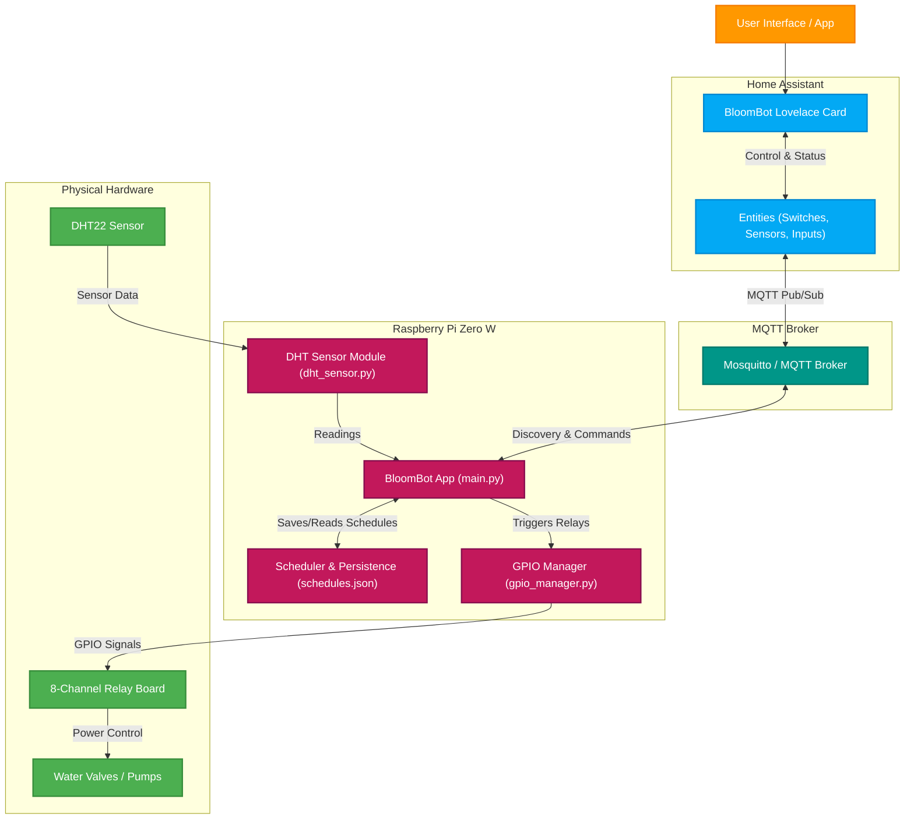

<p align="center">
  
</p>

<h1 align="center">BloomBot</h1>

<p align="center">
  <strong>Your friendly garden irrigation controller.</strong><br>
  Using a Raspberry Pi, with home assistant integration.
</p>

<p align="center">
  <a href="https://github.com/vallejohan/bloombot/actions/workflows/ci.yml">
    
  </a>
  
  <a href="https://github.com/vallejohan/bloombot/blob/main/LICENSE">
    
  </a>
  <a href="https://github.com/vallejohan/bloombot/releases">
    
  </a>
</p>

---

## What is BloomBot?
A lightweight garden and greenhouse irrigation controller running on a **Raspberry Pi Zero W** (or any other Raspberry Pi) to control a 5V relay board. It integrates with **Home Assistant** over **MQTT** using automatic discovery, and supports both scheduled watering (by time-of-day and duration) and manual overrides.

## Features

- **Multi-Channel Relay Control:** Toggle individual water valves/relays on physical GPIO pins.
- **Humidity & temperature measurement:** Measure the humidity and temperature in the garden/greenhouse using an appropriate sensor (such as DHT22 or a DHT11).
- **Home Assistant Auto-Discovery:** No manual YAML configuration required in Home Assistant. Switches, schedule toggles, start times, and watering durations register automatically.
- **Persistent Schedules:** Schedules are stored locally in `schedules.json` so that they survive Raspberry Pi reboots or power cycles.
- **Flexible Timing:** Set the start time (HH:MM:SS) and duration (1 to 10 minutes) for each relay.
- **Safety Auto-Shutoff:** If the scheduler triggers a relay, it automatically shuts off after the configured duration. If a manual OFF override is received during watering, the timer is immediately cancelled.
- **GPIO Fallback & Mocking:** Automatically detects the physical `gpiozero` library. If run on a non-Pi machine (like Windows/Mac for testing), it runs in **Mock mode** allowing you to test Home Assistant communications.

---

## Limitations & Considerations

Before starting there are some limitations with this project that are good to consider: 

- **WiFi Range Outdoors:** The onboard PCB antenna of the Raspberry Pi Zero W has limited range, which is further reduced when placed inside an enclosure. If the Pi is far from your router, you may experience intermittent MQTT disconnections.
   * *Tip:* Consider planning where the hardware should be placed and if any additional WiFi range extenders are needed.
- **Power Consumption:** Unlike low-power microcontrollers (such as the ESP32) which can enter deep-sleep mode and draw microamps, a Raspberry Pi Zero W consumes quite substantially more power.
  * *Tip:* Running BloomBot purely on batteries is doable, but much less efficient compared to for example an ESP32 device. One option could be to use a larger solar panel setup (e.g., 10W+ solar panel, with a larger 12V LiFePO4 battery, and a step-down converter). A mains-powered supply is highly recommended, if possible.
- **No Native Analog Inputs:** The Raspberry Pi lacks analog-to-digital converters (ADC), in case that you'd like to add analog devices. 
   * *Tip:* If you plan to expand the hardware to read analog soil moisture sensors, or utilize other sensors, you will need to add an external ADC device.

> [!NOTE]
> **Design Philosophy & Hardware Selection**
> 
> This project was originally planned around an ESP32 microcontroller. While an ESP32 would be more optimal on several fronts, such as low power consumption, native ADC support, and support for wireless protocols like Zigbee or Thread, a Raspberry Pi was chosen for a few key reasons:
> - **Power & Proximity:** The greenhouse is close to the main house with a direct power line, which minimizes power consumption constraints.
> - **Extensibility & Easy Updates:** Running a full Linux environment allows for trivial Over-the-Air (OTA) updates and leaves the door open to run other companion services on the same device in the future. That being said, there are also options for OTA updates on ESP32 devices as well.
> - **Hardware Reuse:** It was a good opportunity to put a spare Raspberry Pi board I had lying around to good use.


## System Architecture

BloomBot uses a modular architecture to bridge physical hardware with Home Assistant over an MQTT interface. The main components are detailed below, followed by a system diagram showing how they connect.

1. **BloomBot Core (Raspberry Pi):** A Python application running as a system service. It reads ambient temperature and humidity sensors (via a Linux kernel overlay driver) and manages GPIO outputs to trigger relays.
2. **Local Scheduler & Persistence:** The scheduler runs directly on the Pi and relies on a local JSON file (`schedules.json`) for persistence, ensuring that schedules persist and trigger even during network outages.
3. **MQTT Discovery Layer:** On startup, the script registers all switches, sensors, numbers, and system status configuration topics to the Home Assistant MQTT broker automatically.
4. **Home Assistant Control:** A custom companion frontend card (`bloombot-card`) displays status information and allows the user to easily configure watering schedules, durations, and trigger manual overrides.



---

## Hardware Setup

To build the BloomBot controller, you will need the hardware components listed in the Bill of Materials section below. The setup is not restricted to the specific models listed, you can choose various components and scale the number of relays (valves) as needed to fit your garden zones.

### Bill of Materials (BOM)

| Component | Description | Quantity | Example | Notes |
| :--- | :--- | :---: | :--- | :--- |
| **Raspberry Pi** | Raspberry Pi Zero W (or Zero 2 W, RPi 3/4/5) with SD Card | 1 | Raspberry Pi Zero 2 W | Any model with a 40-pin GPIO header will work. |
| **Relay Board** | 5V or 3.3V active-low relay module (1 to 8 channels) | 1 | Elegoo 8-Channel Relay Module | Configure the pins in [config.py](src/config.py) based on your board. |
| **DHT22 / DHT11** | Temperature and humidity sensor | 1 | DHT22 (AM2302) | Optional. Used for monitoring climate; can be disabled in configuration. |
| **Water Valves / Pumps** | 12V solenoid valves (or 24V AC valves / 5V DC pumps) | 1 - 8 | Generic 12V Solenoid Valve | Match the quantity to your garden zones and ensure matching power supply. |
| **Power Supplies** | 12V switching PSU & step-down DC-DC converters | 1 - 2 | Meanwell switching 12V PSU & LM2596 Buck Converter | Separate power supply for relay coils is recommended to isolate noise. |
| **Enclosure** | 3D-printable enclosure | 1 | Custom 3D-printed case | Optional. Helps protect components outdoors (see [Enclosure box](#enclosure-box)). |
| **Misc** | Jumper wires, terminal blocks, mounting hardware | - | Dupont jumper wires, Wago 221 connectors | For connecting and mounting the hardware. |

### Wiring

The wiring schematic image below shows how the hardware components can be wired together. Some good points to take into consideration when setting up this system:

- **Active-Low vs. Active-High:** Most common 8-channel relay boards are *Active-Low* (relays switch ON when the control pin is pulled to GND). This is configured via `ACTIVE_LOW = True` in [config.py](src/config.py).
- **Isolating power to relay and Rpi:** To isolate the Raspberry Pi from relay noise and ensure the 5V relay coils have sufficient power, the usage of two 5V DC-DC converters is recommended (as shown in the schematic). However, using a single 5V DC-DC converter is fully functional as well.

<picture>
  
</picture>

### Enclosure box

There is an enclosure box that can be 3d-printed to fit the hardware components. The box has holdings for the Raspberry Pi, relay board, and DHT22 sensor, as well as hole for input power and water valve cables. STL files (and 3mf file) can be found in the [assets/3d-models](assets/3d-models) directory.

---

## Installation & Setup on Raspberry Pi

### 1. Install System Dependencies

Open a terminal on your Raspberry Pi and ensure all required system utilities and build tools are installed:

```bash
sudo apt update
sudo apt install -y python3 python3-pip python3-venv python3-gpiozero swig liblgpio-dev python3-dev build-essential
```

> [!NOTE]
> * **Relay Control:** On modern Debian/Ubuntu environments (such as RPi OS Bookworm), legacy GPIO interfaces are deprecated. To control pins correctly, the application compiles `lgpio` in the virtual environment via the modern `/dev/gpiochip*` API, requiring the compilation dependencies (`swig`, `liblgpio-dev`, `python3-dev`, `build-essential`).

### 2. Clone and Prepare the Script

First, install **uv** if it isn't already installed:

```bash
curl -LsSf https://astral.sh/uv/install.sh | sh
```

> [!TIP]
> After the installer completes, you may need to restart your terminal session or run `source $HOME/.local/bin/env` (for bash/zsh) to add `uv` to your `PATH` variable.

Navigate to your workspace directory and synchronize the dependencies to set up a virtual environment:

```bash
cd /path/to/your/workspace/bloombot
uv sync
```

### 3. Enable Linux Kernel DHT Overlay (Required for DHT22 Sensor)

Python-based user-space bit-banging is highly sensitive to CPU scheduling jitter (especially on single-core devices like the Raspberry Pi Zero W). To achieve stable readings, this application relies on the built-in **Linux Kernel Driver**. The kernel handles timing-sensitive pulse measurements asynchronously via hardware interrupts.

To enable the kernel driver:

1. Open the Raspberry Pi firmware configuration file:
   ```bash
   sudo nano /boot/firmware/config.txt
   ```
2. Scroll to the bottom of the file and add the following lines (under the `[all]` block if present):
   ```text
   [all]
   dtoverlay=dht11,dht22,gpiopin=4
   ```
3. Save the file and reboot your Raspberry Pi:
   ```bash
   sudo reboot
   ```

### 4. Configuration

To configure BloomBot, you can copy the `.env.example` template to `.env` and adjust the variables to fit your network and system:

```bash
cp .env.example .env
```

Open `.env` and set the parameters:
- `MQTT_HOST`: Set your Home Assistant broker IP (defaults to `homeassistant.local`).
- `MQTT_PORT`: Port of the broker (defaults to `1883`).
- `MQTT_USERNAME` / `MQTT_PASSWORD`: MQTT broker login credentials if enabled.
- `MQTT_CLIENT_ID`: The client ID for the MQTT connection (defaults to `rpi_relay_controller`).
- `PERSISTENCE_FILE`: File name to save schedules (defaults to `schedules.json`).
- `DHT_PIN`: BCM pin number connected to the DHT sensor (defaults to `4`).
- `DHT_INTERVAL`: Sensor reading and publishing frequency in seconds (defaults to `60`).

*Note: For properties like `ACTIVE_LOW` and `RELAY_PINS`, you can modify their default values directly in [config.py](src/config.py).*

---

## Running the Daemon

### Running Manually (Testing/Development)

You can run the daemon manually to verify the MQTT broker connection and check the terminal log outputs:

```bash
uv run python src/main.py
```

### Running as a Persistent System Service (`systemd`)

To run the daemon automatically when the Pi boots and ensure it restarts on crashes:

1. Create a systemd service file:
   ```bash
   sudo nano /etc/systemd/system/bloombot.service
   ```

2. Paste the following configuration:
   ```ini
   [Unit]
   Description=BloomBot Irrigation Controller Daemon
   After=network.target mqtt.service

   [Service]
   Type=simple
   User=pi
   WorkingDirectory=/home/pi/bloombot
   ExecStart=/home/pi/bloombot/.venv/bin/python src/main.py
   Restart=always
   RestartSec=5

   [Install]
   WantedBy=multi-user.target
   ```

   > [!IMPORTANT]
   > Replace `User=pi`, `/home/pi/` and paths in the service file above with the actual username and directory path of your Raspberry Pi user if your username is not `pi` (modern Raspberry Pi OS installations require a custom username).

   *(Note: The daemon will automatically load the configuration variables from the `.env` file located in the configured `WorkingDirectory`.)*

3. Enable and start the service:
   ```bash
   sudo systemctl daemon-reload
   sudo systemctl enable bloombot.service
   sudo systemctl start bloombot.service
   ```

4. View service logs to monitor execution:
   ```bash
   sudo journalctl -u bloombot.service -f
   ```

---

## Testing in Mock Mode (Without a Raspberry Pi)

If you are developing or testing on a laptop/desktop computer (e.g. Windows/Mac):

1. Synchronize the environment:
   ```bash
   uv sync
   ```
2. Run the application:
   ```bash
   uv run python src/main.py
   ```
3. The daemon will print `[GPIO-MOCK]` lines showing what the physical pins *would* be doing when you toggle switches in Home Assistant.
4. Use **MQTT Explorer** or the Home Assistant developer tools to verify that entities publish their states and commands are received correctly.

---

## Home Assistant Dashboard Setup

This project includes a Lovelace card designed to control scheduled and manual irrigation valves with configuration dialogs.

<p align="center">
  
</p>

### New to Home Assistant?

If you do not have a Home Assistant instance running yet, follow these steps to get started:
1. **Installation:** Refer to the official [Home Assistant Installation Guide](https://www.home-assistant.io/installation/) to learn how to install Home Assistant OS or Core on a Raspberry Pi 4/5, dedicated computer, or virtual machine.
2. **HACS Installation:** To install the BloomBot card directly, you need the **Home Assistant Community Store (HACS)**. Follow the official [HACS Download & Setup Guide](https://hacs.xyz/docs/setup/prerequisites) to enable HACS on your instance.

### Installation via HACS (Home Assistant Community Store)

1. Go to **HACS** in your Home Assistant dashboard.
2. Click the **three dots** in the top right corner and select **Custom repositories**.
3. Add the repository URL: `https://github.com/vallejohan/bloombot`
4. Select the category **Dashboard** and click **Add**.
5. The **BloomBot Card** will now appear in your list. Click **Download** in the bottom right corner.

### Dashboard Configuration

Once installed, you can add the card to your dashboard using the Custom UI card selector. 

For the complete configuration options table, list of custom icons, and configuration examples, refer to the [BloomBot card configuration guide (info.md)](info.md).

You can also view a complete dashboard configuration example in [bloombot-card-example.yaml](home-assistant/dashboard-examples/bloombot-card-example.yaml).

---

## Local Unit Testing & Quality Checks

To ensure code health, safety, and format compliance, you can run the following validation tools.

### Python Backend Checks

All Python code quality tools are managed via `uv` in the project's development group.

#### 1. Code Style & Linting (Ruff)
To check for formatting issues and lint warnings:
```bash
uv run ruff check src tests
uv run ruff format --check src tests
```

To automatically format the code and fix auto-fixable lint errors:
```bash
uv run ruff check --fix src tests
uv run ruff format src tests
```

#### 2. Static Type Checks (Mypy)
Verify static types and prevent type errors:
```bash
uv run mypy src tests
```

#### 3. Security Audits (Bandit & Dependency Audit)
Scan for common security vulnerabilities and audit dependencies:
```bash
uv run bandit -r src/
uv pip audit
```

#### 4. Run the Unit Test Suite
To run the full suite of unit tests:
```bash
uv run python -m unittest discover -s tests
```

---

### BloomBot Home Assistant Card Checks

To run quality checks on the BloomBot Home Assistant card (`dist/bloombot-card.js`), ensure you have Node.js installed, then install the dev dependencies:

```bash
npm install --no-save eslint @eslint/js prettier
```

#### 1. Static Analysis (ESLint)
Verify JavaScript syntax, unresolved variables, and runtime safety:
```bash
npx eslint dist/bloombot-card.js
```

#### 2. Code Formatting (Prettier)
Check and write formatting:
```bash
npx prettier --check dist/bloombot-card.js
npx prettier --write dist/bloombot-card.js
```

