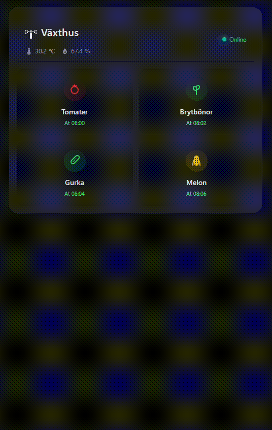

# BloomBot Irrigation Card

A custom gardening card for Home Assistant to control scheduled and manual irrigation valves with configuration dialogs.



## Features
- **Vibrant & Responsive Grid Layout**: Card interface designed to control multiple watering zones (relays).
- **Visual Status Indicators**: Instant active/inactive states with color-coded status elements (active/manual/schedule details).
- **Interactive Configuration Modals**: Click on any zone to open a modal dialog allowing you to toggle manual watering, configure scheduling, or adjust watering duration.
- **Embedded Sensors**: Shows current system temperature and humidity metrics if sensors are available.

See [BloomBot GitHub repository](https://github.com/vallejohan/bloombot) for a full walkthrough of the setup.

## Installation

1. Open **HACS** in your Home Assistant dashboard.
2. Search for **BloomBot Card**.
3. Click **Download** in the bottom right corner.

## Dashboard Configuration

Add the card to your dashboard using the Custom UI card selector.

### Configuration Example
```yaml
type: custom:bloombot-card
name: Garden Irrigation
columns: 2
relays:
  - id: 1
    name: Tomatoes
    icon: tomato
    icon_color: "#ef4444"
  - id: 2
    name: Beans
    icon: sprout
    icon_color: "#22c55e"
  - id: 3
    name: Cucumber
    icon: cucumber
    icon_color: "#22c55e"
  - id: 4
    name: Melons
    icon: melon
    icon_color: "#eab308"
```

### Options

| Name | Type | Requirement | Description | Default |
|---|---|---|---|---|
| `type` | string | **Required** | Must be `custom:bloombot-card` (or `custom:bloombot-card-secondary`). | |
| `name` | string | Optional | Header title of the card. | `BloomBot` |
| `columns` | number | Optional | Number of grid columns for the relays list. | `2` |
| `temp_entity` | string | Optional | Temperature sensor entity (e.g., `sensor.bloombot_temperature`). | `sensor.bloombot_temperature` |
| `humidity_entity` | string | Optional | Humidity sensor entity (e.g., `sensor.bloombot_humidity`). | `sensor.bloombot_humidity` |
| `system_status_entity` | string | Optional | System connectivity binary sensor (e.g., `binary_sensor.bloombot_status`). | `binary_sensor.bloombot_status` |
| `relays` | list | **Required** | List of relays to display on the grid. | |

#### Relay Options

| Name | Type | Requirement | Description | Default |
|---|---|---|---|---|
| `id` | number | **Required** | The ID of the relay (1-indexed, e.g. `1` to `8`). | |
| `name` | string | **Required** | Display name for the watering zone. | |
| `entity` | string | Optional | The switch entity to trigger manual watering (e.g., `switch.bloombot_relay_1`). | `switch.bloombot_relay_<id>` |
| `schedule_enabled_entity` | string | Optional | Switch entity to toggle scheduling on/off (e.g., `switch.bloombot_relay_<id>_schedule_enabled`). | `switch.bloombot_relay_<id>_schedule_enabled` |
| `start_times_entity` | string | Optional | Sensor entity containing the schedules array (e.g., `sensor.bloombot_relay_<id>_start_times`). | `sensor.bloombot_relay_<id>_start_times` |
| `duration_entity` | string | Optional | Number input entity for configuring duration in minutes (e.g., `number.bloombot_relay_<id>_duration`). | `number.bloombot_relay_<id>_duration` |
| `icon` | string | Optional | Icon name for the relay (can be a [built-in custom icon name](#built-in-custom-svg-icons) or any standard `mdi:<name>`). | `mdi:water-pump` |
| `icon_color` | string | Optional | CSS color for the active/configured relay icon (e.g., `#ef4444` or `green`). Can also use `color` as an alias. | |

### Built-in Custom SVG Icons

The card includes built-in custom SVG icons for various plants and garden elements. To use one of the custom icons, set the `icon` field of a relay in your dashboard configuration to any of the following names:

* **Vegetables**: `tomato`, `cucumber`, `carrot`, `corn`, `chili`, `pepper`, `pumpkin`, `squash`, `potato`, `eggplant`, `broccoli`, `pea`, `radish`, `cabbage`, `onion`, `garlic`, `mushroom`
* **Fruits**: `apple`, `banana`, `cherry` (or `cherries`), `grape` (or `grapes`), `strawberry`, `pear`, `citrus` (or `orange`, `lemon`), `pineapple`, `watermelon`, `melon`, `berry` (or `berries`)
* **Gardening & Utility**: `sprout`, `leaf`, `flower`, `tree`, `pot`, `sprinkler`, `pump`

*Note: Any other string in the `icon` configuration field will fall back to standard Home Assistant/MDI icons (e.g. `mdi:water`).*
